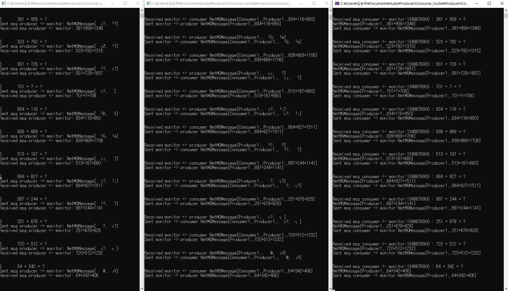

# Load balancing server using netMQ

## Role of processes
### Producer
- Generate two random integers (item1, item2).
- Send them to a monitor through REQ socket.
- Receive the result of addition of two integers and print it out.

### Monitor
- Receive a message from a producer and forward it to an available consumer.
- Receive a calculation result from a consumer forward it to the producer.

### Consumer
- Send the "READY" message and wait for the monitor forwarding producer's message.
- Receive a mission in a message from the monitor through REQ socket.
- Add two integers and send the result to the monitor.

## Main Issue
- Synchronization
- Message Queue
- Message Type

## What is implemented
- P : M : C = 1 : 1 : 1   Tested.

